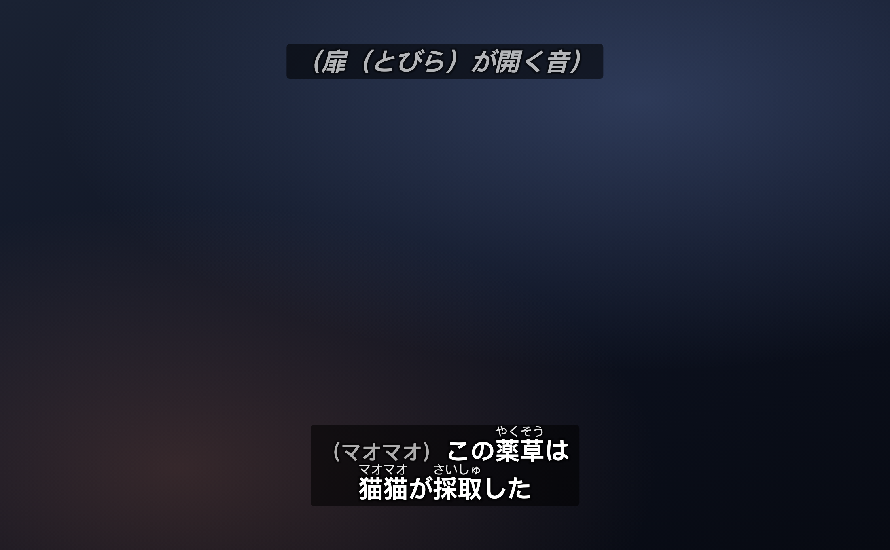
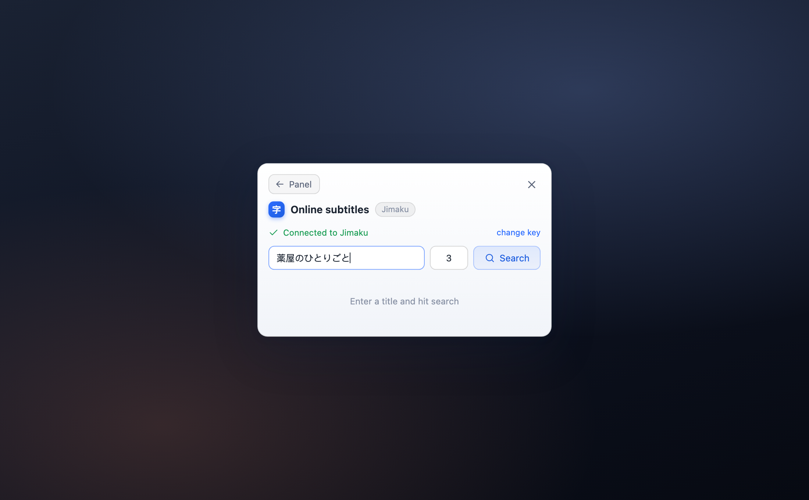

# AnySub · どんな動画にも字幕を(日本語学習向け)

[English](./README.md) · [中文](./README.zh-CN.md) · **日本語**

**どんな**ウェブサイトの HTML5 動画も日本語イマージョン学習ツールに変えます。AnySub は動画に字幕ファイルをマウントし、学習者が本当に欲しい機能を加えます——**漢字ごとに正確なふりがな**、**ワンクリックの [Jimaku](https://jimaku.cc) 字幕取得＋次話への自動継続**、**話者名・効果音・心の声を一目で区別できるセマンティック整形**。

純粋なユーザースクリプトで、バックエンド不要・アップロードなし・データは端末外に出ません。Chrome / Edge / Safari / Firefox 対応。UI は **英語 / 中国語 / 日本語**(自動判定・切替可)。



> 汎用の字幕ローダーとしても優秀です:任意の SRT / VTT / ASS / SSA をどんな動画にもドロップして、スタイルを整えるだけ。日本語向け機能はすべて任意で、邪魔になりません。

## 日本語学習に AnySub を使う理由

- 🈁 **漢字ごとに正確なふりがな。** テキスト字幕の `温厚（おんこう）`/`使徒《しと》` を漢字上のかなとして表示。素朴なツールと違い、AnySub は**読みを正しい漢字に対応させます**:`近接猟兵（りょうへい）` では りょう/へい を `猟兵` にのみ振り、`近接` は空白のまま——読みを全体に塗りつぶしません。コンパクトな KANJIDIC2 読みテーブル(常用＋人名用、約 3000 字)と連濁・促音対応のアラインメント処理を同梱——**数 MB のトークナイザーもランタイム通信も不要**。
- 🎭 **セマンティック字幕整形**(アニメ向け・切替可)。日本語 CC は約物に意味を込めます。AnySub はそれを再整形します(整形のみ、文字は削りません):
  - **話者名** `（マオマオ)セリフ` → 名前を淡色・縮小し、視線が直接セリフへ。
  - **非音声** 単独の `（ドアが開く音)`/`（ざわざわ)`(効果音・動作)→ 斜体・淡色。
  - **画外音／心の声** `〈…〉`/`＜…＞`(電話・ナレーション・内心)→ 斜体。
  - **書面／引用** `《…》`(手紙・画面の文字・読み上げ;ルビの `漢字《かな》` とは区別)→ 明朝系に切替、「書かれた文字」らしく。
  - **歌詞** 行頭 `♪` → 斜体。
  - **行またぎ／cue またぎのスパン**:`〈…` がある行で開き `…〉` が数行後で閉じる場合、間の行もすべてマーク(`《》`・`♪…♪` も同様)。
- 🔍 **ワンクリック オンライン字幕([Jimaku](https://jimaku.cc))。** `Alt+Shift+F` → アニメ検索 → 作品選択 → ファイル選択 → マウント完了。半自動:常に候補を提示し、誤った字幕を黙って読み込みません。作品名は AniList で解決、ASS を優先。検索欄はページタイトルから**作品名＋話数を自動入力**。
- ⏭️ **次話の自動継続。** SPA で話数が変わる(ページタイトルの話数変化)と、古い字幕を消して**同じ出典**の次話を自動読み込み(同じ字幕グループ／リリース)。同源が見つからないときだけ候補を提示。手作業ゼロで一気見。

## その他の機能

- 📂 ローカル字幕ファイル(選択 / ドラッグ&ドロップ / **クリア**)——**ファイルは端末外に出ません**(SRT/VTT は完全オフライン)。
- 🎬 **SRT / VTT / ASS / SSA** に対応。
- ✨ **ASS/SSA 高精度描画**:遅延読み込みの [libass-wasm](https://github.com/libass/JavascriptSubtitlesOctopus) で斜体/太字/縁取り/位置/エフェクト/フォントを再現。読み込み失敗(オフライン/CSP)時は**自動的にテキスト表示へ降格**し、字幕は常に見えます。
- 🎨 **自前のオーバーレイ描画**:スタイルを完全に制御でき、ブラウザ間で一貫(Safari の `::cue` 制限を受けません)。
  - 背景:縁取り / **半透明(既定)** / 黒地 / なし;色:白 / 黄 / シアン / 緑。
  - **文字サイズはプレイヤー高さに比例**し、ウィンドウでも全画面でも見え方が一定;余白は調整可。
- 🧭 **セリフは下、非音声は上**(一貫したメンタルモデル):下/上トグルでセリフのアンカーを設定(既定は下)。セリフ・話者名・画外音・歌詞はそこに、複数話者は積み重ねて名前で区別;**真の効果音**(単独 `（…)`)だけが反対側に。
- 🖥️ **全画面追従**:オーバーレイが全画面要素へ自動的に再アタッチ。
- 🈶 自動**エンコーディング判定**:UTF-8 → GBK → Big5 →(日本語)Shift-JIS / EUC-JP フォールバック。
- ⏱️ **タイムオフセット**:±0.1 / ±1 のステップボタン、または任意の秒数を手入力。**オフセット記憶**:「作品＋字幕出典」ごとに記憶・永続化し、話またぎ/再オープンで自動復元。
- 🔎 **Shadow DOM を貫通**して動画を検出;ページに複数動画があるときは「動画を選ぶ」ボタン。
- ⌨️ **キーボードショートカット**(`Ctrl+Shift` でも `Alt+Shift` でも可):`S` パネル · `F` オンライン · `V` 表示切替 · `O` ローカル · `←/→` オフセット ∓0.1s。入力中は反応しません。
- 🫧 **ミニマルな UI**:既定でフローティングボタンなし・ポップアップなし。ショートカットでパネルを呼び出し(ボタンは任意で有効化)。
- 🪶 **アイドル時のコストゼロ**:字幕未読み込み＆ボタン無効なら、オブザーバーやタイマーを一切接続せず、全ページへの注入はほぼ無コスト。
- 💾 **設定の永続化**:文字サイズ / 位置 / 背景 / 色 / 言語をサイトごとに記憶(localStorage)。
- ⚙️ 描画は**イベント駆動＋インターバルのフォールバック**(rAF 非依存)で、バックグラウンドタブ/PiP でも安定。

## スクリーンショット

| 設定パネル | オンライン検索(Jimaku) |
| --- | --- |
|  |  |

## インストール

> インストールするのはビルド成果物 [`dist/anysub.user.js`](./dist/anysub.user.js) です(ソースは `src/`、下の「開発」を参照)。

### Chrome / Edge / Firefox

1. [Tampermonkey](https://www.tampermonkey.net/) または [Violentmonkey](https://violentmonkey.github.io/) をインストール。
2. [`dist/anysub.user.js`](./dist/anysub.user.js) の raw ファイルを開くと、マネージャーが検出してインストールを提案します。
   - または:Tampermonkey → 新規スクリプト → `dist/anysub.user.js` の全内容を貼り付け → 保存。

### Safari(macOS / iOS)

1. App Store から [Userscripts](https://apps.apple.com/us/app/userscripts/id1463298887)(オープンソース・無料)をインストール。
2. Safari → 設定 → 機能拡張 → Userscripts を有効化し、サイトでの実行を許可。
3. ツールバーの Userscripts アイコン →「Open App」→ `dist/anysub.user.js` をスクリプトフォルダに追加。
   - 本スクリプトは標準 Web API(`@grant none`)のみを使用し、GM 特権 API に依存しないため、Safari でも完全に動作します。

## 使い方

1. 動画のあるページを開く。
2. **`Alt+Shift+S`**(または `Ctrl+Shift+S`)でパネルを開く——あるいはパネルでフローティングボタンを有効化。
3. 「ファイルを開く」/ 字幕をパネルにドラッグ——または「オンライン字幕」(`Alt+Shift+F`)で Jimaku から取得。
4. 必要に応じてオフセット / 文字サイズを調整。**ふりがな** と **話者・効果音タグ** をオンにして日本語向け機能を利用。

## 開発

ソースは機能別の ES モジュール(`src/`)に分割され、[Vite](https://vitejs.dev) + [vite-plugin-monkey](https://github.com/lisonge/vite-plugin-monkey) で `==UserScript==` ヘッダー付きの単一ファイル `dist/anysub.user.js` にバンドルされます。

```bash
npm install       # 依存関係をインストール
npm run build     # ビルド → dist/anysub.user.js
npm run dev       # 開発サーバー:ホットリロード + マネージャーへワンクリック導入
npm test          # 単体テスト(Node 内蔵の node:test、追加依存ゼロ)
```

純ロジックのモジュールには単体回帰テスト(`test/`、`node --test`)があり、過去の落とし穴を網羅:パース(XSS エスケープ・空行・NaN/時系列)、ASS パース、タイトル解析(旧字体の話数)、ふりがなルビと漢字アラインメント、セマンティック分類、**話またぎの同源マッチング**、エンコーディング判定。DOM/描画/ネットワークは `demo.html` をブラウザで手動検証。

### 構成

```
src/
├── main.js         エントリ:init + 動的な動画監視(MutationObserver)
├── state.js        グローバル状態 + 定数
├── i18n.js         UI ローカライズ(en / zh / ja、ブラウザ判定 + 切替可)
├── locator.js      Shadow DOM を貫通して <video> を検出
├── decode.js       ファイル読み込み + エンコーディング判定
├── parse.js        SRT/VTT → 統一 cue 構造(XSS 安全・時系列ソート)
├── parse-ass.js    ASS/SSA → cue(テキストフォールバック用)
├── overlay.js      オーバーレイ配置 / 全画面追従(形式非依存)
├── render-text.js  テキストレンダラー(renderer インターフェース実装)
├── render-ass.js   ASS レンダラー:テキストフォールバック + libass 昇格
├── octopus-loader.js  libass-wasm の遅延読み込み(blob worker + CDN wasm/フォント)
├── controller.js   描画ループ + 動画ライフサイクル + 現在のレンダラー
├── loader.js       読み込みフロー + 形式レジストリ(ローカル/オンライン共通)
├── cue-format.js   セマンティック分類(純ロジック・テスト有)
├── anilist.js      作品名 → AniList 候補(認証不要)
├── jimaku.js       Jimaku API クライアント(key 必要)
├── online.js       オンライン編成:作品特定 → ファイル一覧 → ダウンロード
├── match.js        話またぎ「同源」マッチング(純ロジック・テスト有)
├── search-ui.js    オンライン検索パネル(候補リスト)
├── title-parse.js  ページタイトル → 作品名 + 話数(日本語/旧字体対応)
├── ruby.js         ふりがな(《》/｜/括弧 → <ruby>、漢字ごと)
├── furigana-align.js  読み → 漢字アラインメント(連濁/促音;テスト有)
├── kanji-readings.js  同梱の漢字読みテーブル(ビルド時に生成)
├── episode-watch.js 話変更検出 + 同源の自動継続
├── ui.js           設定パネル + フローティングボタン + ドラッグ + 動画選択
├── shortcuts.js    キーボードショートカット(Alt+Shift、capture 段階)
├── watcher.js      DOM オブザーバーのオンデマンド ライフサイクル(アイドルで切断)
├── styles.js       注入 CSS(ライト/ダークトークン)
├── storage.js      設定の永続化(localStorage)
└── notify.js       トースト + ステータスバー
```

**描画層はプラガブル**:`controller` がループを駆動し、`{ mount, renderAt(video, rect, layoutChanged), applyStyle, destroy }` を実装する「レンダラー」を 1 つ保持します。`overlay` が動画に整列したボックス(形式非依存)を担い、レンダラーはそこに描画します。`loader` の**形式レジストリ**がファイル種別でレンダラーを選びます。

### 設計メモ

**描画**は自前のオーバーレイ(動画上に `div` を重ね、`timeupdate` で現在字幕を表示)を使用:ネイティブの `TextTrack` / `::cue` に比べ、背景/縁取り/色/位置を完全に制御でき、文字サイズをプレイヤー高さに比例させ、ブラウザ間(特に Safari)で一貫します。`requestAnimationFrame` ではなく**イベント駆動＋インターバルのフォールバック**——rAF はバックグラウンドタブで停止し、イベント駆動の方が CPU も軽い。全画面時はオーバーレイを `document.fullscreenElement` に再アタッチします。ローカルファイルはすべて標準の `<input type=file>` / ドラッグ&ドロップで読み、`GM_*` インターフェースは一切使いません。

**ASS 高精度**は「まずフォールバック、後で昇格」:`.ass/.ssa` を開くとまずテキストレンダラーで即表示(オフライン可)しつつ、バックグラウンドで libass-wasm を遅延読み込み。準備が整えば canvas 高精度描画へ切替、いずれかがネットワークやサイト CSP に阻まれた場合は**テキスト描画を維持**し、字幕は常に表示されます。

**ふりがなの漢字アラインメント**は汎用トークナイザー(kuromoji のようにランタイムで数 MB の辞書を読み込むもの)を使わず、[KANJIDIC2](https://www.edrdg.org/kanjidic/kanjidic2.xml.gz) から抽出したコンパクトな「漢字→読み」テーブル(常用＋人名用 約 3000 字、ひらがな正規化、gzip 約 35KB)を同梱し、初回のみ `JSON.parse`。アラインメントはメモ化した再帰探索:各漢字の読み候補で括弧内のかな列を消費し、連濁(は→ば)や促音(がく→がっ)の変種を動的生成。全体が合わないときは左から漢字を剥がして最長被覆解を探し(「読みが後半だけを覆う」場合に対応)、それでも合わなければ全体ルビへフォールバック(熟字訓、例:`今日→きょう`)。

> 辞書データ © [EDRDG](https://www.edrdg.org/) KANJIDIC2、[CC BY-SA 4.0](https://creativecommons.org/licenses/by-sa/4.0/) に基づき使用。

## ロードマップ

- [x] ~~自前オーバーレイ描画(スタイル制御・プレイヤー比例スケール・全画面追従)~~(v0.2.0)
- [x] ~~設定の永続化~~(v0.4.0)
- [x] ~~ASS/SSA 高精度描画(libass-wasm)、テキストフォールバック~~(v0.7.0)
- [x] ~~オンライン字幕検索(Jimaku、半自動候補)~~(v0.9.0)
- [x] ~~タイトル自動入力 + 次話の自動継続(同源優先)~~(v0.10.0)
- [x] ~~漢字ごとのふりがなアラインメント(KANJIDIC2)~~(v0.13.0)
- [x] ~~セマンティック整形 + セリフ/非音声の配置~~(v0.14.0)
- [x] ~~UI の i18n(English / 中文 / 日本語)~~(v0.15.0)
- [ ] クロスオリジン iframe 内の動画対応
- [ ] 対応形式の追加(SUB/SBV/LRC/SMI/TTML)
- [ ] ASS カスタムフォント(埋め込み / ユーザー提供)
- [ ] キーボードショートカットの再割り当て
