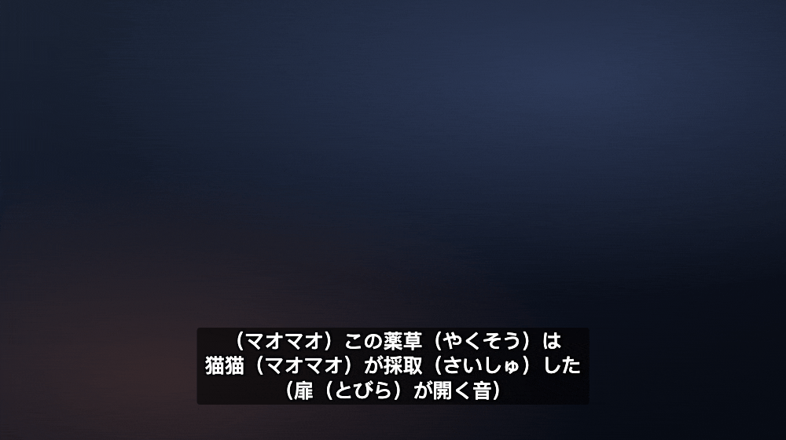
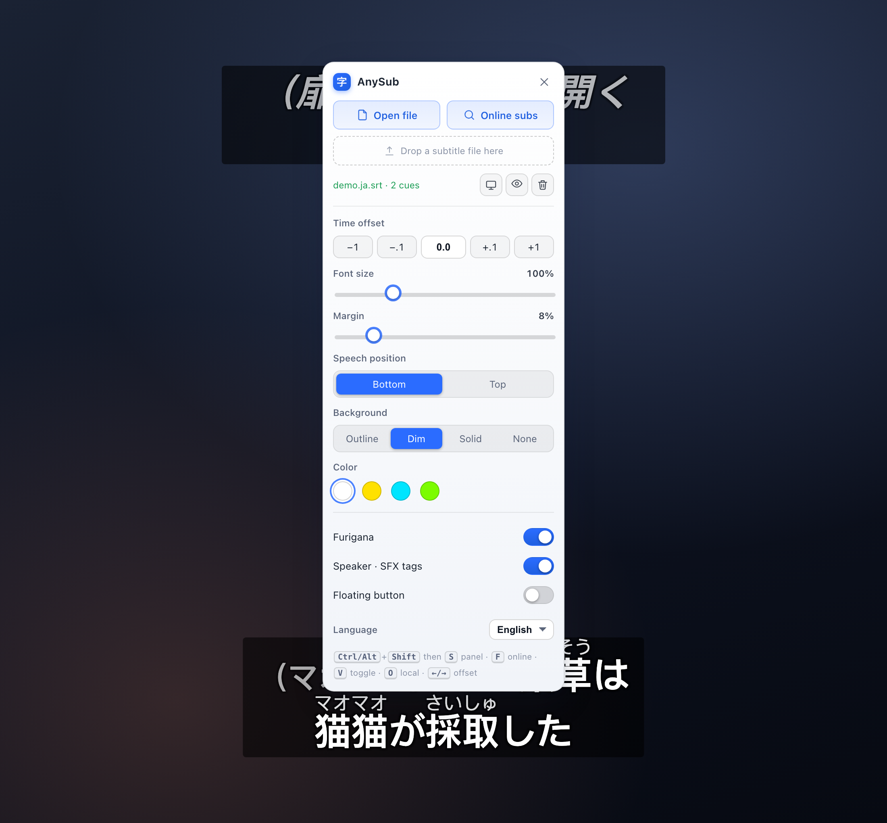
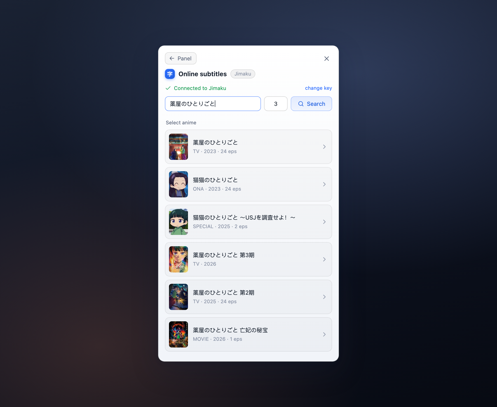

# AnySub · Japanese Immersion Subtitles for Any Video

**English** · [中文](./README.zh-CN.md) · [日本語](./README.ja.md)

Turn **any** website's HTML5 video into a Japanese-immersion tool. AnySub mounts subtitle files onto the video and adds the things immersion learners actually want — **accurate per-kanji furigana**, **one-click [Jimaku](https://jimaku.cc) subtitles with auto next-episode**, and **semantic caption formatting** that tells speaker names, sound effects and inner-voice apart at a glance.

Pure userscript — no backend, no upload, nothing leaves your machine. Works on Chrome / Edge / Safari / Firefox. UI in **English / 中文 / 日本語** (auto-detected, switchable).



> Also a perfectly good *general* subtitle loader: drop any SRT / VTT / ASS / SSA onto any video, style it, done. The Japanese features are opt-in and stay out of your way.

## Why AnySub for learning Japanese

- 🈁 **Accurate per-kanji furigana.** Text subtitles like `温厚（おんこう）` / `使徒《しと》` render as kana above the kanji. Unlike naive tools, AnySub **aligns readings to the right characters**: `近接猟兵（りょうへい）` puts りょう/へい over `猟兵` only and leaves `近接` bare, instead of smearing the reading across the whole run. It ships a compact KANJIDIC2 reading table (jōyō + jinmeiyō, ~3000 kanji) and a rendaku/gemination-aware alignment algorithm — **no multi-megabyte tokenizer, no runtime network**.
- 🎭 **Semantic caption formatting** (anime-oriented, toggleable). Japanese closed captions carry meaning in their punctuation; AnySub re-typesets it (formatting only, never dropping text):
  - **Speaker name** `（マオマオ）dialogue` → the name dims and shrinks so your eye jumps straight to the line.
  - **Non-speech** standalone `（ドアが開く音）` / `（ざわざわ）` (SFX / action) → italic, dimmed.
  - **Off-screen / inner voice** `〈…〉` / `＜…＞` (phone, narration, thoughts) → italic.
  - **Written / quoted** `《…》` (letters, on-screen text, read-aloud) → switches to a serif face, like "written words" (disambiguated from ruby `漢字《かな》`).
  - **Lyrics** leading `♪` → italic.
  - **Cross-line / cross-cue spans**: an `〈…` that opens in one line and closes `…〉` several lines later keeps every line in between marked (same for `《》` and `♪…♪`).
- 🔍 **One-click online subtitles ([Jimaku](https://jimaku.cc)).** `Alt+Shift+F` → search anime → pick title → pick file → mounted. Semi-automatic: candidates are always shown, never a silent wrong-subtitle load. Titles are resolved via AniList, ASS preferred. The search box **pre-fills the title + episode from the page title**.
- ⏭️ **Auto next-episode.** When an SPA changes episodes (page-title episode number changes), AnySub clears the old subtitle and **auto-loads the next episode from the same source** (same fansub/release), falling back to candidates only if no same-source match. Binge with zero manual steps.

## Everything else

- 📂 Local subtitle files (pick / drag-drop / **clear**) — **files never leave your device** (SRT/VTT fully offline).
- 🎬 Supports **SRT / VTT / ASS / SSA**.
- ✨ **High-fidelity ASS/SSA** via lazily-loaded [libass-wasm](https://github.com/libass/JavascriptSubtitlesOctopus): italics, bold, outlines, positioning, effects, fonts. **Falls back to plain text automatically** if it can't load (offline / CSP), so subtitles are always visible.
- 🎨 **Custom overlay renderer** — full style control, consistent across browsers (not limited by Safari's `::cue`):
  - Background: outline / **dim (default)** / solid / none.
  - Color: white / yellow / cyan / green.
  - **Font scales with player height**, so it looks the same windowed or fullscreen.
  - Adjustable margin from the edge.
- 🧭 **Speech at the bottom, non-speech on top** (one consistent mental model): a Bottom/Top toggle sets the speech anchor (default bottom); dialogue / speaker names / off-screen voice / lyrics go there, multiple speakers stack and are told apart by name; only **true SFX** (standalone `（…）`) sit on the opposite edge.
- 🖥️ **Fullscreen following**: the overlay re-attaches to the fullscreen element automatically.
- 🈶 Automatic **encoding detection**: UTF-8 → GBK → Big5 → (Japanese) Shift-JIS / EUC-JP fallback.
- ⏱️ **Timeline offset**: ±0.1 / ±1 step buttons, or type any number of seconds. **Offset memory**: remembered per "anime + subtitle source" and restored automatically across episodes / reopens.
- 🔎 Locates video **through Shadow DOM**; a "pick video" button when a page has several.
- ⌨️ **Keyboard shortcuts** (`Ctrl+Shift` or `Alt+Shift`, barely ever collide with a site's single keys): `S` panel · `F` online · `V` show/hide · `O` local file · `←/→` offset ∓0.1s. Ignored while typing.
- 🫧 **Minimal UI**: no floating ball by default, no popups — summon the panel with a shortcut (the floating ball is opt-in).
- 🪶 **Zero idle cost**: with no subtitle loaded and the ball off, it connects no observers/timers — injecting into every page is practically free.
- 💾 **Settings persist** (font / position / background / color / language, per site via localStorage).
- ⚙️ Rendering is **event-driven + interval fallback** (not rAF), so background tabs / PiP stay stable.

## Screenshots

| Settings panel | Online search (Jimaku) |
| --- | --- |
|  |  |

## Install

> You install the build output [`dist/anysub.user.js`](./dist/anysub.user.js) (source is in `src/`, see [Development](#development)).

### Chrome / Edge / Firefox

1. Install [Tampermonkey](https://www.tampermonkey.net/) or [Violentmonkey](https://violentmonkey.github.io/).
2. Open the raw [`dist/anysub.user.js`](./dist/anysub.user.js) — the manager detects it and offers to install.
   - Or: Tampermonkey → New script → paste the whole contents of `dist/anysub.user.js` → Save.

### Safari (macOS / iOS)

1. Install [Userscripts](https://apps.apple.com/us/app/userscripts/id1463298887) from the App Store (open-source, free).
2. Safari → Settings → Extensions → enable Userscripts and allow it on websites.
3. Toolbar Userscripts icon → "Open App" → drop `dist/anysub.user.js` into its scripts folder.
   - AnySub uses only standard Web APIs (`@grant none`), no GM-privileged interfaces, so Safari support is complete.

## Usage

1. Open any page with a video.
2. Press **`Alt+Shift+S`** (or `Ctrl+Shift+S`) to open the panel — or enable the floating ball in the panel.
3. **Open file** / drag a subtitle onto the panel — or **Online subs** (`Alt+Shift+F`) to fetch from Jimaku.
4. Tune offset / font size as needed. Toggle **Furigana** and **Speaker · SFX tags** for the Japanese features.

## Development

Source is split into ES modules (`src/`) and bundled by [Vite](https://vitejs.dev) + [vite-plugin-monkey](https://github.com/lisonge/vite-plugin-monkey) into a single `dist/anysub.user.js` with a `==UserScript==` header.

```bash
npm install       # install dependencies
npm run build     # build → dist/anysub.user.js
npm run dev       # dev server: hot reload + one-click install into your manager
npm test          # unit tests (Node's built-in node:test, zero extra deps)
```

Pure-logic modules have unit regression tests (`test/`, via `node --test`) covering past pitfalls: parsing (XSS escaping, blank lines, NaN/time ordering), ASS parsing, title parsing (old-form kanji episode numbers), furigana ruby & per-kanji alignment, semantic caption classification, same-source episode matching, encoding detection. DOM / rendering / network are verified via `demo.html` in a browser.

### Layout

```
src/
├── main.js         entry: init + dynamic video watching (MutationObserver)
├── state.js        global state + constants
├── i18n.js         UI localization (en / zh / ja, browser-detected + switchable)
├── locator.js      locate <video> through Shadow DOM
├── decode.js       read file + encoding detection
├── parse.js        SRT/VTT → unified cue structure (XSS-safe, time-sorted)
├── parse-ass.js    ASS/SSA → cue (text fallback)
├── overlay.js      overlay positioning / fullscreen following (format-agnostic)
├── render-text.js  text renderer (implements the renderer interface)
├── render-ass.js   ASS renderer: text fallback + libass upgrade
├── octopus-loader.js  lazy-load libass-wasm (blob worker + CDN wasm/fonts)
├── controller.js   render loop + video lifecycle + current renderer
├── loader.js       load flow + format registry (shared local/online)
├── cue-format.js   semantic caption classification (pure logic, unit-tested)
├── anilist.js      title → AniList candidates (no auth)
├── jimaku.js       Jimaku API client (needs key)
├── online.js       online orchestration: locate → list files → download
├── match.js        cross-episode "same source" matching (pure logic, tested)
├── search-ui.js    online search panel (candidate list)
├── title-parse.js  page title → anime name + episode (JP / old-form kanji)
├── ruby.js         Japanese furigana (《》/｜/parens → <ruby>, per-kanji)
├── furigana-align.js  reading → per-kanji alignment (rendaku/gemination; tested)
├── kanji-readings.js  bundled kanji reading table (generated at build time)
├── episode-watch.js episode-change detection + same-source auto-continue
├── ui.js           settings panel + floating ball + drag + pick-video
├── shortcuts.js    keyboard shortcuts (Alt+Shift, capture-phase)
├── watcher.js      on-demand DOM-observer lifecycle (disconnects when idle)
├── styles.js       injected CSS (light/dark tokens)
├── storage.js      settings persistence (localStorage)
└── notify.js       toast + status bar
```

**The render layer is pluggable**: `controller` drives the loop and holds one "renderer" implementing `{ mount, renderAt(video, rect, layoutChanged), applyStyle, destroy }`. `overlay` owns the video-aligned box (format-agnostic); the renderer draws into it. A **format registry** in `loader` picks the renderer by file type.

### Design notes

**Rendering** uses a custom overlay (a `div` layered over the video, updated on `timeupdate`): versus native `TextTrack` / `::cue` it gives full control of background/outline/color/position, scales font by player height, and is consistent across browsers (Safari especially). It's **event-driven + interval fallback** rather than `requestAnimationFrame` — rAF is paused in background tabs, and event-driven is lighter on CPU. In fullscreen the overlay re-attaches to `document.fullscreenElement`.

All local files are read via standard `<input type=file>` / drag-drop — no `GM_*` interfaces — for full Safari compatibility.

**High-fidelity ASS** is "fallback first, upgrade later": opening `.ass/.ssa` shows the text renderer immediately (works offline) while libass-wasm lazy-loads in the background (blob `<script>` to avoid eval/CSP-inline; worker bundled into a blob with `Module.locateFile` pointing wasm/fonts at a CDN). Once ready it swaps to canvas high-fidelity; if any step is blocked by network or site CSP, it **keeps the text renderer** so subtitles stay visible.

**Furigana per-kanji alignment** avoids a general tokenizer (kuromoji-class ones load megabytes of dictionary at runtime). Instead it bundles a compact "kanji → readings" table extracted from [KANJIDIC2](https://www.edrdg.org/kanjidic/kanjidic2.xml.gz) (jōyō + jinmeiyō, ~3000 kanji, hiragana-normalized, ~35KB gzipped), stored with the script and `JSON.parse`d only on first use. Alignment is a memoized DFS: each kanji's reading candidates consume the kana in the parens, generating rendaku (は→ば) and gemination (がく→がっ) variants; when the whole run won't align it peels kanji from the left to find the longest cover (handles "reading covers only a suffix"), and falls back to whole-run ruby for jukujikun (e.g. `今日→きょう`).

> Dictionary data © [EDRDG](https://www.edrdg.org/) KANJIDIC2, used under [CC BY-SA 4.0](https://creativecommons.org/licenses/by-sa/4.0/).

## Roadmap

- [x] ~~Custom overlay renderer (style control, player-relative scaling, fullscreen following)~~ (v0.2.0)
- [x] ~~Settings persistence~~ (v0.4.0)
- [x] ~~High-fidelity ASS/SSA (libass-wasm), text fallback~~ (v0.7.0)
- [x] ~~Online subtitle search (Jimaku, semi-automatic candidates)~~ (v0.9.0)
- [x] ~~Title pre-fill + auto next-episode (same-source first)~~ (v0.10.0)
- [x] ~~Per-kanji furigana alignment (KANJIDIC2)~~ (v0.13.0)
- [x] ~~Semantic caption formatting + speech/non-speech positioning~~ (v0.14.0)
- [x] ~~UI i18n (English / 中文 / 日本語)~~ (v0.15.0)
- [ ] Cross-origin iframe video support
- [ ] More formats (SUB/SBV/LRC/SMI/TTML)
- [ ] Custom ASS fonts (embedded / user-provided)
- [ ] Rebindable keyboard shortcuts

## License

Code: [MIT](./LICENSE). The bundled KANJIDIC2 kanji-reading data (`src/kanji-readings.js`) is © [EDRDG](https://www.edrdg.org/) and used under [CC BY-SA 4.0](https://creativecommons.org/licenses/by-sa/4.0/).
